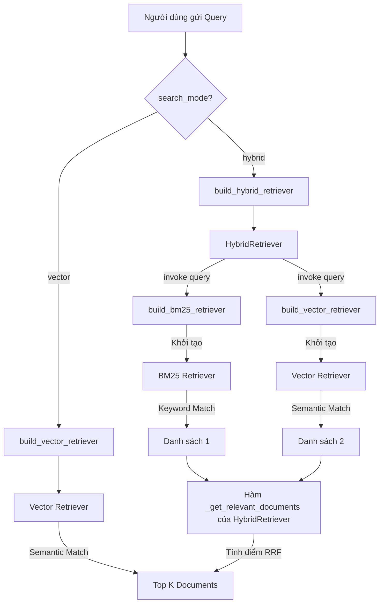

# [Feature 2] Hybrid Search (BM25 + Vector + RRF)

**Branch:** `feature/hybrid-search`
**Commit:** `b3a5341`
**Ngày:** 2026-04-17

### Mục tiêu

Vector search (FAISS) rất tốt với câu hỏi ngữ nghĩa, nhưng yếu với các
từ khoá chính xác như mã số, tên riêng, thuật ngữ kỹ thuật (vì embedding
hay ánh xạ chúng sang vector gần nhau).

BM25 (keyword search) bù đắp đúng điểm yếu đó, nhưng lại thiếu khả năng
hiểu ngữ nghĩa và paraphrase.

Tính năng này kết hợp cả hai qua **Reciprocal Rank Fusion (RRF)**, cho phép
người dùng chọn chế độ retrieval và điều chỉnh trọng số, đồng thời cung cấp
endpoint `/compare` để so sánh hiệu quả hai chế độ trực tiếp.

### Kiến trúc thay đổi

```
Trước (v2):
  query → FAISS retriever → top-K chunks → LLM → AskResponse

Sau (v3):
                   ┌─ BM25 retriever  → ranked list (w: bm25_weight)
  query ───────────┤                              ↓
                   └─ FAISS retriever → ranked list (w: 1-bm25_weight)
                                               ↓
                              Reciprocal Rank Fusion (RRF)
                                               ↓
                              fused top-K chunks → LLM → AskResponse (+ search_mode)

  POST /compare:
    query → run_rag("vector") + run_rag("hybrid") → CompareResponse (side-by-side + latency_ms)
```

### Thuật toán RRF — Tại sao không dùng score-based fusion?

BM25 và cosine similarity có **scale hoàn toàn khác nhau** (BM25 có thể là 5.3,
cosine similarity trong khoảng [0, 1]). Cộng trực tiếp sẽ cho kết quả sai.

RRF giải quyết bằng cách chỉ dùng **thứ hạng** thay vì điểm tuyệt đối:

```
score(doc) = bm25_weight   × 1 / (rank_bm25   + k_rrf)
           + vector_weight × 1 / (rank_vector  + k_rrf)
```

- `k_rrf = 60` (hằng số, giảm ảnh hưởng của rank-1 quá cao)
- Documents xuất hiện trong cả hai danh sách được cộng dồn điểm → ưu tiên hơn
- **Không cần chuẩn hóa (normalization)** — đây là ưu điểm lớn nhất

> **Lưu ý kỹ thuật:** `EnsembleRetriever` của LangChain không khả dụng trong
> phiên bản `langchain 1.x` đang dùng. `HybridRetriever` được tự implement,
> kế thừa `BaseRetriever` của LangChain để giữ nguyên interface chuẩn.

### Files thay đổi

| File | Loại | Mô tả |
|---|---|---|
| `requirements.txt` | MODIFY | Thêm `rank_bm25>=0.2.2` |
| `src/rag/retriever.py` | **NEW** | 3 factory functions + `HybridRetriever` (RRF) |
| `src/rag/pipeline.py` | MODIFY | `build_index()` → `RAGIndex`, `run_rag()`, `compare_search_modes()` |
| `src/models.py` | MODIFY | `RAGIndex` dataclass, `AskRequest` (search_mode, bm25_weight), `SearchResult`, `CompareResponse` |
| `app.py` | MODIFY | `INDEX_DB`, `/ask` nhận `search_mode`, endpoint `/compare` mới |

### Chi tiết `src/rag/retriever.py` (module mới)

Khác với kiến trúc cũ nơi retriever bị gắn chặt vào pipeline, `retriever.py` được thiết kế theo mẫu **Factory Pattern**. Module này cung cấp 3 hàm builder để khởi tạo các retriever độc lập, cùng với một class `HybridRetriever` tùy chỉnh.

#### 1. Luồng dữ liệu (Data Flow) giữa các hàm

Sơ đồ dưới đây trình bày cách các thành phần liên kết với nhau từ lúc query được gửi đến cho đến khi trả về danh sách Document:



#### 2. Vai trò của từng hàm/class cụ thể:

*   **`build_vector_retriever(vectorstore, k)`**: 
    *   **Chức năng**: Lấy một `FAISS` vectorstore đã được index và "bọc" (wrap) nó lại thành một đối tượng `BaseRetriever` của LangChain.
    *   **Cơ chế**: Dành cho Semantic Search. Sử dụng thuật toán k-Nearest Neighbors (k-NN) trên không gian vector (thường dùng cosine similarity) để tìm các văn bản có *ý nghĩa* gần giống với câu hỏi nhất, ngay cả khi không trùng từ khóa.
*   **`build_bm25_retriever(chunks, k)`**: 
    *   **Chức năng**: Khởi tạo một lưới từ vựng (index) trực tiếp từ danh sách các đoạn văn bản (chunks) bằng thuật toán BM25 và trả về một `BM25Retriever`.
    *   **Cơ chế**: Dành cho Keyword Search. BM25 (Best Match 25) đánh giá độ liên quan dựa trên tần suất xuất hiện của các từ khóa chính xác trong truy vấn so với toàn bộ văn bản. RAT tốt cho các mã số, tên riêng.
*   **`class HybridRetriever(BaseRetriever)`**: 
    *   **Chức năng**: Đây là "trái tim" của hệ thống Hybrid Search. Do `EnsembleRetriever` của Langchain không có sẵn trong môi trường dự án, class này được tạo ra để tự thực thi thuật toán RRF.
    *   **Cơ chế**: Nó chứa bên trong cả `vector_retriever` và `bm25_retriever`. Khi gọi `.invoke(query)`, nó sẽ:
        1.  Chạy đồng thời cả 2 retriever con để lấy ra 2 danh sách kết quả riêng biệt.
        2.  Thực hiện RRF: Duyệt qua từng Document trong cả 2 danh sách. Vị trí rank (thứ hạng 1, 2, 3...) của Document trong mỗi danh sách sẽ được quy đổi thành điểm (điểm càng cao nếu rank càng nhỏ).
        3.  Cộng tổng điểm lại theo trọng số `bm25_weight` vs `vector_weight`.
        4.  Sắp xếp lại danh sách Document cuối cùng dựa trên tổng điểm mới.
*   **`build_hybrid_retriever(vectorstore, chunks, k, bm25_weight)`**: 
    *   **Chức năng**: Hàm Factory đóng vai trò "nhà thầu chính". Khi pipeline yêu cầu chế độ hybrid, nó sẽ gọi hàm này. Hàm này sẽ tự động gọi hai hàm `build_vector` và `build_bm25` ở trên để khởi tạo 2 retriever con, sau đó "tiêm" (inject) chúng vào class `HybridRetriever` và trả về class đó cho pipeline sử dụng.

```python
# 3 factory functions có thể hoán đổi nhau:

build_vector_retriever(vectorstore, k=4)
# → FAISS.as_retriever() — semantic search

build_bm25_retriever(chunks, k=4)
# → BM25Retriever.from_documents() — keyword search

build_hybrid_retriever(vectorstore, chunks, k=4, bm25_weight=0.5)
# → HybridRetriever (RRF) — kết hợp cả hai
# Validate: bm25_weight ∈ [0.0, 1.0], raise ValueError nếu sai
```

### Chi tiết `RAGIndex` — Tại sao cần lưu cả `chunks`?

```python
@dataclass
class RAGIndex:
    vectorstore: Any          # FAISS — dùng cho semantic search
    chunks: list[Document]    # raw chunks — dùng để build BM25 index lúc query
```

BM25 cần **raw text** của các chunks để xây index mỗi lần query.
Nếu chỉ lưu FAISS, BM25 không có dữ liệu để hoạt động.
Cả hai cùng dùng chung **một lần chunking** từ lúc upload → nhất quán.

### API mới — `POST /ask` với `search_mode`

```json
// Hybrid (mặc định)
POST /ask
{
  "file_id": "abc-123",
  "question": "Điều khoản số 5.2 quy định gì?",
  "search_mode": "hybrid",
  "bm25_weight": 0.6
}

// Pure vector
{
  "file_id": "abc-123",
  "question": "Tóm tắt chính sách bảo vệ quyền lợi người dùng",
  "search_mode": "vector"
}
```

### API mới — `POST /compare` (đánh giá performance)

```json
POST /compare
{ "file_id": "abc-123", "question": "BM25 hoạt động như thế nào?" }

→ Response:
{
  "question": "BM25 hoạt động như thế nào?",
  "vector_result": {
    "answer": "...",
    "citations": [...],
    "latency_ms": 312.5
  },
  "hybrid_result": {
    "answer": "...",
    "citations": [...],
    "latency_ms": 287.3
  }
}
```

> `/compare` gọi LLM 2 lần — chỉ dùng cho mục đích đánh giá.

### Kiểm thử

**53 unit tests** — PASSED (40.96s).
Bao gồm 25 tests từ Feature 1 + 28 tests mới.

| Test file | Tests | Phạm vi kiểm thử |
|---|---|---|
| `tests/test_retriever.py` | 13 | `build_bm25_retriever` (keyword match, metadata), `build_vector_retriever`, `build_hybrid_retriever` (weight validation, RRF results) |
| `tests/test_pipeline.py` | 15 | `build_index()` → `RAGIndex` structure, `_build_prompt()` content, `_format_chat_history()`, `_build_citation_list()` |

**Test đặc trưng — validate weights:**
```python
# bm25_weight ngoài [0.0, 1.0] phải raise ValueError
with pytest.raises(ValueError, match="bm25_weight"):
    build_hybrid_retriever(vs, chunks, bm25_weight=1.5)  # ✅ raise

# Biên [0.0] và [1.0] phải hợp lệ
build_hybrid_retriever(vs, chunks, bm25_weight=0.0)  # ✅ không raise
build_hybrid_retriever(vs, chunks, bm25_weight=1.0)  # ✅ không raise
```

### Khi nào dùng chế độ nào?

| Câu hỏi dạng... | Nên dùng |
|---|---|
| "Tóm tắt nội dung chương 3" | `vector` |
| "Ý nghĩa của đoạn đề cập đến X là gì?" | `vector` |
| "Điều khoản 5.2.1 quy định gì?" | `hybrid` |
| "Giá trị 1.234.567 đề cập ở đâu?" | `hybrid` |
| "Tên công ty ABC Corp xuất hiện mấy lần?" | `hybrid` (bm25_weight cao hơn) |
| Không chắc | `hybrid` (mặc định) — an toàn nhất |
